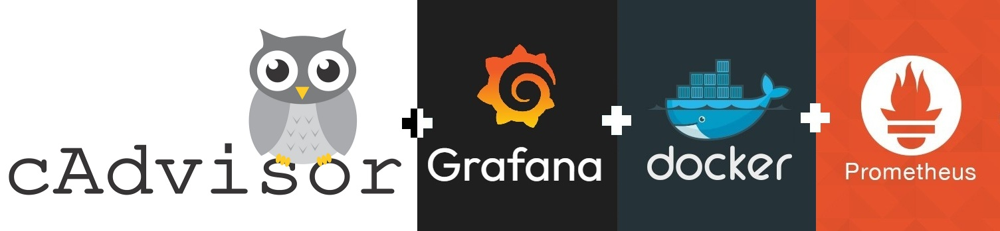

<h1 id="top" align="center">🚢 v1.0.0 🚢</h1>

<br>

<div align="center">
    
</div>

<br>

## 🔍 Table of Contents

- [Features](#features)
- [System Startup](#system-startup)

<br/>

<h2 id="features">🔥 Features</h2>

- **Docker Compose Deployment:** Simplifies deployment with Docker Compose configuration, enabling easy setup and service orchestration without complex commands.
- **Network Setup:** Integrates Node-Exporter with other metric tools with other networks.

<br/>

<h2 id="releases">🚢 Releases</h2>

&nbsp; [](https://github.com/ahmettoguz/monitor-cadvisor/tree/v1.0.0)

<br/>

<h2 id="system-startup">🚀 System Startup</h2>

- Create a new directory named `monitor`.

```
mkdir monitor
cd monitor
```

- Clone project.

```
git clone https://github.com/ahmettoguz/monitor-cadvisor
```

- Create `network-monitor` network if not exists.

```
docker network create network-monitor
```

- Run Container.

```
docker stop                             monitor-cadvisor-c
docker rm                               monitor-cadvisor-c
docker compose -p monitor up --build -d cadvisor
docker compose -p monitor up -d         cadvisor
docker logs -f                          monitor-cadvisor-c
```

<br/>

### [🔝](#top)
