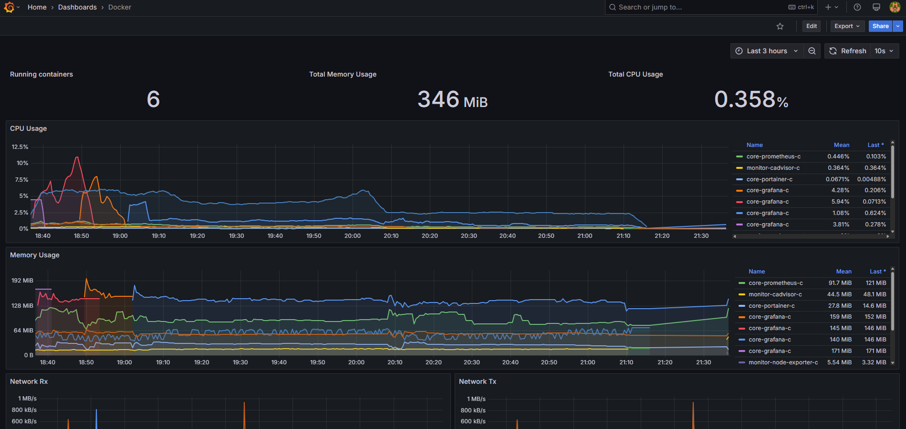

<h1 id="top" align="center">Monitor cAdvisor</h1>

<br>

<div align="center">
    
</div>

<br>

## 🔍 Table of Contents

- [About Project](#intro)
- [Dashboard](#dashboard)
- [Technologies](#technologies)
- [Features](#features)
- [Releases](#releases)
- [System Startup](#system-startup)
- [Contributors](#contributors)

<br/>

<h2 id="intro">📌 About Project</h2>

Container Advisor (cAdvisor) is a tool designed to provide insights into containerized applications. This project enables easy deployment of cAdvisor, allowing seamless integration with Prometheus and Grafana for container monitoring.

<br/>

<h2 id="dashboard">🦉 Dashboard</h2>

<div align="center">
    
</div>

<br/>

<h2 id="technologies">☄️ Technologies</h2>

&nbsp; [](https://www.docker.com)

&nbsp; [](https://grafana.com)

<br/>

<h2 id="features">🔥 Features</h2>

- **Docker Compose Deployment:** Simplifies deployment with Docker Compose configuration, enabling easy setup and service orchestration without complex commands.
- **Network Setup:** Integrates cAdvisor with other metric tool networks.

<br/>

<h2 id="releases">🚢 Releases</h2>

&nbsp; [](https://github.com/ahmettoguz/monitor-cadvisor/tree/v1.1.0)

&nbsp; [](https://github.com/ahmettoguz/monitor-cadvisor/tree/v1.0.0)

<br/>

<h2 id="system-startup">🚀 System Startup</h2>

- Create a new directory named `monitor`.

```
mkdir monitor
cd monitor
```

- Clone project.

```
git clone https://github.com/ahmettoguz/monitor-cadvisor
```

- Create `network-monitor` network if not exists.

```
docker network create network-monitor
```

- Run container.

```
docker stop                             monitor-cadvisor-c
docker rm                               monitor-cadvisor-c
docker compose -p monitor up --build -d cadvisor
docker compose -p monitor up -d         cadvisor
docker logs -f                          monitor-cadvisor-c
```

- Refer to [`Node-Exporter`](https://github.com/ahmettoguz/monitor-node-exporter) repository to expose node metrics.

- Refer to [`Prometheus`](https://github.com/ahmettoguz/monitor-prometheus) repository to integrate prometheus to scrap data.

- Refer to [`Grafana`](https://github.com/ahmettoguz/monitor-grafana) repository to integrate grafana to visualize node exporter data.

- Refer to [`Traefik`](https://github.com/ahmettoguz/core-traefik) repository to expose traefik metrics and also launch reverse proxy.

<br/>

<h2 id="contributors">👥 Contributors</h2>

<a href="https://github.com/ahmettoguz" target="_blank"></a>

### [🔝](#top)
